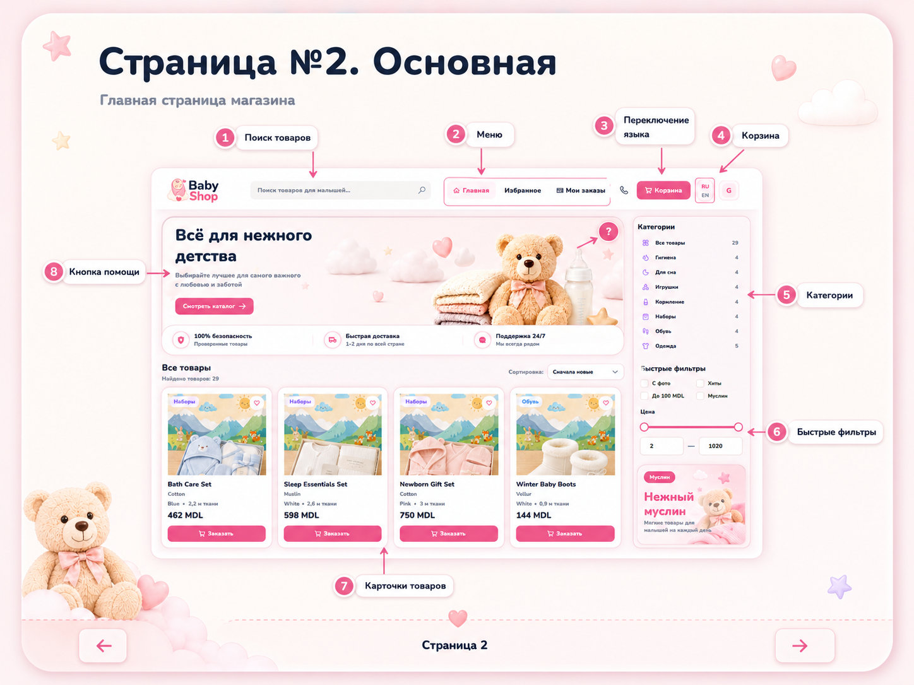

# BabyShop WPF

WPF desktop application for baby shop management with a MySQL database backend.



## Overview

BabyShop is a Windows desktop application built with WPF and .NET 8. It combines a customer storefront with an administrator workspace for managing catalog data, orders, reports, analytics, backups, and user access.

The project includes:

- customer catalog with search, filters, favorites, cart, and checkout
- administrator CRUD screens for core database tables
- role-based access with permissions
- analytics dashboard and filtered reports
- order receipts and backup history tools

## Tech Stack

- .NET 8 (`net8.0-windows`)
- WPF / XAML
- C#
- MySQL / MariaDB
- stored procedures and SQL views
- `MySql.Data`
- `SharpVectors`

## Features

### Customer side

- sign in and registration
- product catalog with search, sorting, and quick filters
- favorites management
- shopping cart and checkout
- order history and receipt preview

### Admin side

- add, edit, and delete records in main tables
- lookup-driven forms with validation
- dashboard with filters and aggregate metrics
- filtered and analytical reports
- backup and restore helpers
- user and permission-aware access control

## Project Structure

- [MainWindow.xaml.cs](MainWindow.xaml.cs) - administrator workspace
- [UserMainWindow.xaml.cs](UserMainWindow.xaml.cs) - customer storefront
- [Repositories/BabyShopRepository.cs](Repositories/BabyShopRepository.cs) - data access and business operations
- [Repositories/AuthRepository.cs](Repositories/AuthRepository.cs) - authentication and permission loading
- [DashboardWindow.xaml.cs](DashboardWindow.xaml.cs) - analytics dashboard
- [ReportFilterWindow.xaml.cs](ReportFilterWindow.xaml.cs) - report filter UI
- [Reporting](Reporting) - report composition and export
- [Database](Database) - SQL scripts, procedures, and runtime database objects

## Requirements

- Windows
- .NET 8 SDK or Visual Studio 2022 with WPF support
- local MySQL or MariaDB instance
- database named `baby_shop_restored`

The default connection settings are defined in [Configuration/DatabaseSettings.cs](Configuration/DatabaseSettings.cs):

- server: `127.0.0.1`
- port: `3306`
- database: `baby_shop_restored`
- user: `root`

## Getting Started

1. Clone the repository.
2. Create or restore the `baby_shop_restored` database in MySQL.
3. Run the SQL scripts from the [Database](Database) folder that are required for your local setup.
4. Update [Configuration/DatabaseSettings.cs](Configuration/DatabaseSettings.cs) if your local credentials differ.
5. Open [BabyShop.slnx](BabyShop.slnx) in Visual Studio or build from the command line.
6. Start the WPF application.

Command line build:

```powershell
dotnet build BabyShop.csproj
```

## Database Notes

The repository contains SQL scripts for:

- authentication procedures
- favorites and user order links
- lookup tables for address and color
- dashboard and report support objects
- restored runtime procedures for CRUD operations

Useful files:

- [Database/auth_setup.sql](Database/auth_setup.sql)
- [Database/restore_baby_shop_restored_procedures.sql](Database/restore_baby_shop_restored_procedures.sql)
- [Database/restore_missing_runtime_objects.sql](Database/restore_missing_runtime_objects.sql)

## Installer

Installer-related files are kept in the [Installer](Installer) folder. Published payloads and generated installer output are intentionally excluded from Git to keep the repository clean.

## Status

This repository contains the current project source and assets. Build outputs, local backups, and local database files are excluded with `.gitignore`.
